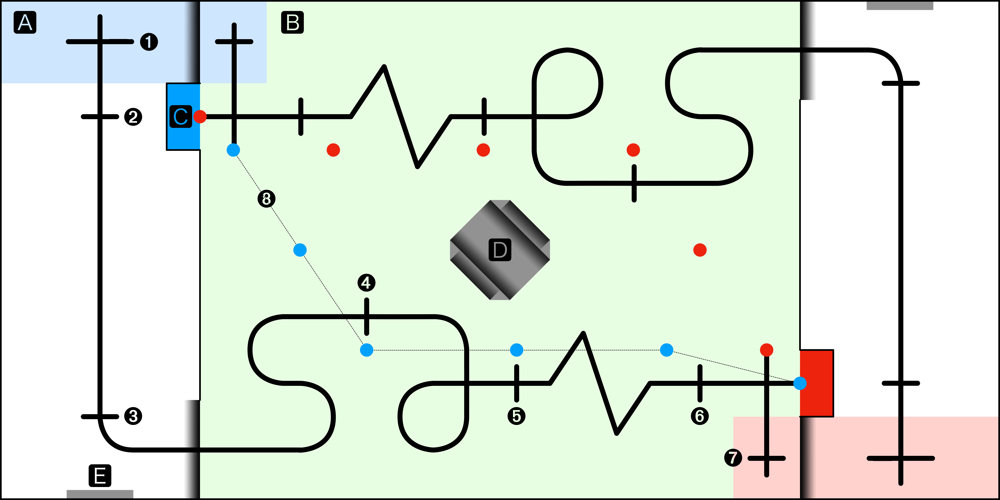
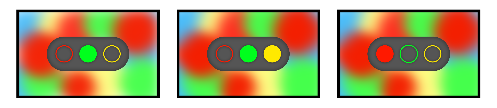

# RM 2021 机甲大师队内赛规则手册 V2.0

队内赛不仅仅是展现个人技术实力的校园比赛，更是一个锻炼自己，考验团队协作，为未来参加全国 RoboMaster 大赛积累经验的良好机会，希望大家可以认真对待，积极参与，在比赛过程中展现出各自的风采。

## 摘要

比赛要求参赛队每组设计一个可移动的机器人，比赛过程中，小组队员需要遥控机器人，抢夺资源岛的弹丸并将弹丸推入自家资源区，控制机器人返回启动区沿引导线自动循迹，完成红绿灯识别，继续沿引导线到达对方资源区，自动夹取对方资源区弹丸，最后停止在终止区或继续完成附加任务，将敌方弹丸沿视觉循迹点运送至自家资源区。

比赛采用积分制度，完成相应的技术动作可以获得对应的技术分值，比赛结果根据积分高低决定。

### 参赛队

每支参赛队由华广机器人野狼队 4-10 名技术组新生组成，共计 10 支队，比赛过程中各队最多允许 1 名本队队员进入赛场对机器人进行复位或重启工作，每支队伍人员配置为（硬件和宣策人员另加安排）：

* 机械组：3-4 人
* 电控组：2-3 人
* 视觉组：1-2 人

为保证比赛的相对公平，对于每组的成员组成，组委会将综合学习进度及平时考核成绩，将该组成员分成 3 小组：优秀、一般和良好；优秀组和良好组的成员均不允许小组内组队，一般组可以自由组队。组委会保留对最终队伍安排的调整权。

### 日程

在备赛阶段，我们会持续更新比赛规则，组织线上答疑并对队内赛规则的各种相关问题提供解答。

- 赛前培训：2020 年 10 月 1 日 - 2021 年 3 月 1 日
- 比赛时间：2021 上半学年开学后 1 个月内

## 机器人

参赛队伍自行制作和开发参赛机器人，每支参赛队制作一台机器人，比赛过程中不得借用非本队机器人进行比赛。

- **机器人的能源**

   1. 参赛队只能使用电池和弹性力作为能源
   2. 参赛队可以自备能源，也可以用组委会提供的格氏航模电池 3S、4S 电池
   3. 供电系统包含多个电路的实测电压不得超过 42 V
   4. 禁止使用任何高危险性能源，电池总容量不得超过 200 Wh，供电电压不得超过 30 V，压缩气体气压不得超过 20 MPa

- **机器人的形态**

   1. 不得分裂为子单元
   2. 机器人重量不得超过 10 KG
   3. 机器人投影至地面的尺寸不得超过 300 mm x 300 mm x 500 mm（长 x 宽 x 高）
   4. 比赛过程变形尺寸不得超过 350 mm x 350 mm x 500 mm（长 x 宽 x 高），允许机器人在限制范围内扩张、伸展或延伸

- **机器人的通讯**

   1. 机器人可以由操作手通过无线操作，允许用 Wi-Fi（IEEE802.11）、Zigbee（IEEE802.15）及 BLE（IEEE802.15.1）
   2. 组委会不监管 Wi-Fi、Zigbee 和 BLE 的环境
   3. 机器人在自动任务区需自动完成全部任务，参赛队员不能使用任何通讯设备与机器人进行控制，遥控器需放在指定区域

- **机器人的安全**

   1. 机器人不得包含有破坏、污染场地的设计元素
   2. 机器人的设计和制作不应对场馆里任何人员造成危险，不应造成对方机器人和比赛场地的损坏
   3. 所有机器人上必须安装硬件急停按钮，禁用爆炸物、明火或危险化学品、蓄压器、铅酸蓄电池
   4. 在设计和使用激光或红外光源时，必须充分注意在全过程中保护场馆内所有人不受伤害（仅允许 2 级以下激光产品使用）
   5. 如果用射频传输信号，必须设计电路和机构，确保在连接中断时不导致失控或危险运动
   6. 如果有多个供电系统，参赛队必须设计电路和机构，无论失电还是打开电源的顺序都不导致失控或发生危险运动
   7. 为了避免因电机堵转等过载而起火或冒烟，必须在电源电路上安装适当的限流装置
   8. 电线、接插件、端子等的额定电流应等于或高于假定最大电流
   9. 机器人的设计者，参赛队对其机器人的安全性负有责任，参赛者应与组委会密切合作，以确保比赛最大限度地安全

## 比赛场地

场地为尺寸为 3 m x 6 m（长 x 宽 ）的矩形，场地中心对称，一场比赛需要两支参赛队，分为蓝队和红队同时上场。

### 区域

- 🅰 启动区 / 终止区

  浅蓝色 / 浅红色（未标出），分别为双方的启动区和终止区。比赛开始前，机器人需要放置在启动区内（机器人在地面的竖直方向投影不得超过启动区的内边线），区域内可手动操作机器人。比赛开始后，机器人从己方启动区出发，完成资源抢夺任务，沿引导线行进，完成巡线和红绿灯识别后到达对方的「启动区」，也就是己方的「终止区」。

- 🅱 资源争夺区

  浅绿色，资源争夺区。除渐变色区域和 🅲 区域外，设有围栏，比赛中机器人不可跨越围栏。任务一完成前，渐变色区域挡板关闭，机器人和弹丸不可通过。

- 🅲 资源储存点

  蓝色（`#00A1FE`） / 红色（`#ED230D`，未标出），分别为双方的弹丸资源储存点。每局开局双方储存点内各有一颗弹丸（白色 RoboMaster 大弹丸）。

- 🅳 资源岛

  浅灰色，资源岛。放置三颗弹丸（白色 RoboMaster 大弹丸）在中央渐变色浅槽中，除两侧渐变色区域外，机器人不可通过。

- 🅴 显示屏放置区
  深灰色，显示屏放置区。面向各方的 🅰 区域，竖直水平放置 10 英寸黑色边框 LCD 液晶显示屏，显示屏距离地面 50 mm，显示屏下方放置有超声波测距器，测距方向与显示屏显示方向平行。

**所有渐变色区域比赛中不进行绘制*

### 标记

- 「➊」 起始标记点

  自动循迹线起始标记点，需要操作手手动将机器人移动至起始点的合适位置后，方可开始自动循迹。经过起始标记点后，若无裁判批准，机器人的运动不得人为干涉。

- 「➋」任务二起始标记点

  任务二起始标记点，机器人中心经过该标记点，即视为开始任务二。如果机器人在任务二中发生错误，故障或需要重启，需要机器人回到该点。

- 「➌」任务二终止标记点 / 任务三起始标记点

  任务二终止标记点 / 任务三起始标记点，机器人中心经过该标记点，即视为任务二结束，开始任务三并计时；如果机器人在任务三中发生错误，故障或需要重启，需要机器人回到该点。

- 「➍ ➎ ➏」重启标记点

  重启标记点，任务三过程中如果机器人中心经过该标记点，如果机器人在任务三中发生错误，故障或需要重启，可将机器人移动至已经过的最新重启标记点进行重启。

- 「➐」结束标记点

  自动循迹线结束标记点，机器人中心经过该标记点，即视为完成比赛常规部分，结束任务三计时。

- 「➑」视觉循迹引导点

  蓝色（`#00A1FE`） / 红色（`#ED230D`，未标出），附加任务视觉循迹引导点（虚线不会绘制），每个视觉循迹引导点为直径 50 mm 的实心圆，两颜色不同的视觉循迹引导点以两条不同的路径，连接双方资源区。

**场地中布置有黑色循迹线，宽为 30 mm，机器人必须沿着黑色引导线完成整个比赛的常规任务，附加任务不做要求*

### 尺寸

比赛场地和「资源岛」的参考尺寸如下图：

## 比赛流程

### 赛制

- **初赛**

   1. 参赛队采取抽签的方式分成 a 和 b 两组，并确定各自的在组内的出场顺序
   2. 初赛阶段参赛队需要完成两轮完整的比赛，第 1 轮 a 组参赛队在红色区域开始比赛， b 组参赛队在蓝色区域开始比赛。每局比赛按照抽签顺序出场，两支参赛队同时在场地中完成比赛。第 2 轮交换场地，a 组参赛队在蓝色区域开始比赛，b 组参赛队在红色区域开始比赛。 出场顺序与上一轮相同
   3. 参赛队在两轮比赛中取成绩最好的 1 次作为初赛的最终成绩进行排名
   4. 最终进入决赛的队伍数量根据参赛队伍数量作为参考而定

- **决赛**

   1. 根据初赛的成绩排名，将奇数排名的队伍分到决赛的 a 组，偶数排名的队伍分到决赛的 b 组，按照排名靠后的队伍优先比赛的原则决定出场顺序
   2. 与初赛赛制相同，参赛队同样需要按照出场顺序在红、蓝区域各完成 1 次比赛
   3. 参赛队在两轮比赛中取成绩最好的 1 次作为决赛的最终成绩

### 规则

按照比赛顺序，裁判指挥两个队伍同时进入比赛场地。同一时刻，一个场地上只允许有两支队伍进行比赛。每次犯规将强制回到启动区重新开始任务。

1. 正式比赛开始前 2 分钟为准备时间，红、蓝两个区域各有一个参赛队伍进入场地。 准备期间，参赛队可在场地内对机器人进行调试，并将机器人放置于启动区内。在 2 分钟准备期间内，每支参赛队有一次机会申请技术暂停，技术暂停时间不超过 5 分钟
2. 裁判发出比赛开始指令后，参赛队员启动机器人，完成比赛任务
3. 存在裁判认为违反比赛公平性的参赛队，裁判可取消其比赛成绩
4. 若裁判判定机器人违规，或队员认为需要机器人重启时，裁判允许时队员可选择任意一个已经通过的重启点对机器人进行重启（只要裁判允许，重启次数没有限制）
5. 违规场景：
   1. 任何机器人的任何部件或令牌落到比赛场地内
   2. 机器人完成自动任务时操作手操控机器人
   3. 违反规则而未在取消比赛资格中提及的其它行为被视为犯规
   4. 某一参赛队误启动。两队必须把机器人放回启动区，比赛重新开始

## 比赛任务

### 常规任务（总计时长 6 分 30 秒）

#### 任务一：资源争夺（总计 4 + 1 分， 时长 3 分钟）

1. 任务一开始前，「资源争夺区」中央置放有「资源岛」，资源岛上放有 3 颗白色弹丸，每队「资源储存点」处放置 1 颗白色弹丸
2. 任务一开始后，双方机器人从各方「启动区 / 终止区」出发至场地中央的「资源岛」，争夺弹丸资源到自家「资源储存点」，不得进入对方「资源储存点」进行争夺对方弹丸
3. 任务一过程中，机器人用以推动弹丸的接触面必须是平面或凸面，弹丸必须至少有 2/3 的投影圆在机器人外；机器人不得使弹丸与机器人固连；机器人及机器人的各个部分必须在「资源争夺区」内（违反以上规则即视为犯规）

- 意外情况：

  1. 机器人故障或发生犯规，双方比赛暂停后，机器人可由操作手原地重启，弹丸由裁判放回「资源岛」
  2. 机器人跨越围栏或挡板，机器人或机器人的一部分处于「资源争夺区」外，双方比赛暂停后，可由操作手将机器人重启至「资源争夺区」内离围栏或挡板最近的一点
  3. 若争夺时弹丸飞出场地或卡在某个死角，双方比赛暂停后，由裁判放回「资源岛」

- 结束条件：

  1. 所有弹丸被收集到双方「资源储存点」处，双方「启动区 / 终止区」挡板打开
  2. 3 分钟后，若仍有弹丸未被收集，资源争夺停止，双方「资源争夺区」的「启动区 / 终止区」处挡车板打开

- 得分规则：

  1. 通过计算「资源储存点」内的弹丸数量进行评分，求弹丸全部投影在「资源储存点」边线内，每 1 枚弹丸得 1 分，最高得 1 + 3 = 4 分，最低得 1 分
  2. 若机器人在任务一过程中没有发生故障或犯规，队伍可得 1 分奖励分，多次故障或犯规不追加扣分

#### 任务二：红绿灯识别（总计 5 + 1 分，时长 90 秒）

1. 任务二开始前，机器人需操作手手动放置在「起始标记点」处，「显示屏放置区」放置有正在显示红绿灯画面的 10 英寸 LCD 液晶显示屏
2. 任务二开始后，机器人需要沿黑色循迹线进行自动循迹，不允许手动控制机器人；经过「任务二起始标记点」后，机器人需要对显示屏中的红绿灯显示信号做出反应，直到机器人到达「任务二终止标记点」
3. 任务二过程中，红绿灯信号会不定时发生变化（两队红绿灯信号同步改变，变化间隔 1.0 s ～ 2.5 s）机器人行停原则遵循红灯停绿灯行；对于每次红绿灯信号变化，机器人需在 0.4 s 内完成对红绿灯信号的识别，并做出响应（完全停止或向前前进）；机器人沿黑色循迹线进行自动循迹过程中，不允许机器人脱离循迹线

- 意外情况：

  1. 机器人故障、脱离循迹线、移动方向错误、对红绿灯识别错误或响应超时，机器人可由操作手在任意一个已通过的标记点处重启并重新尝试
  2. 机器人在经过「任务二起始标记点」前或经过「任务二终止标记点」后对红绿灯信号产生了响应，机器人需由操作手在任意一个已通过的标记点处重启
  3. 机器人在经过「任务二终止标记点」后脱离循迹线、移动方向错误或无法正常开始任务三，机器人需由操作手在任意一个已通过的标记点处重启

- 结束条件：

  1. 机器人全程对红绿灯信号做出正确响应并由循迹线通过红绿灯识别区
  2. 机器人 90 秒内没对红绿灯信号做出正确响应，未通过红绿灯识别区，由操作手将机器人放置在「任务二终止标记点」

- 得分规则：

  1. 机器人在规定时间内成功通过得 5 分，在规定时间内未能通过得 0 分
  2. 经裁判判定，机器人脱离循迹线，识别错误或重启扣 1 分 / 次，最低得 0 分
  3. 优先完成的队伍可得 1 分奖励分，红绿灯识别用时不计入最终排名成绩

- 红绿灯说明：

  如上方三幅例图，分别为显示屏中不同时刻的红绿灯信号画面。红绿灯按红绿黄顺序，置于灰色圆角矩形中，灰色圆角矩形外是干扰色和屏幕边框；实际识别中，红绿灯会随灰色圆角矩形一起运动，干扰色也会不断改变；每次红灯和绿灯互相切换时，黄灯会提前 0.2 s 亮起，以 0.05 s 的间隔闪烁两次，在切换完毕后熄灭。

  主要颜色 HEX 值：

  - 红：`#FF1900`

  - 绿：`#00FF1D`

  - 黄：`#FFE900`

  - 灰：`#555555`

#### 任务三：自动巡线（总计 4 + 1 分，时长 2 分钟）

1. 机器人经过「任务二终止标记点 / 任务三起始标记点」，既视为任务三开始，裁判系统开始计时
2. 任务三开始后，机器人需要沿黑色循迹线进行自动循迹，直到机器人到达「结束标记点」，裁判系统终止计时
3. 任务三过程中，不允许手动控制机器人，机器人不得脱离场地循迹线（若速度较快，允许短暂脱离循迹线，每次脱离时长不超过 0.5 s）

- 意外情况：

  1. 机器人故障、脱离循迹线或移动方向错误，机器人可由操作手在任意一个已通过的标记点处重启并重新尝试
  2. 机器人在经过「结束标记点」后脱离循迹线、移动方向错误或无法正常开始附加任务，机器人需由操作手在任意一个已通过的标记点处重启
  3. 机器人脱离循迹线后，若裁判未能及时控制失控机器人，导致影响另一方的比赛，双方重新开始该任务（仍遵循「得分规则」，若发生接触前双方机器人均脱离循迹线，双方均扣分并重新开始，反之，由失控一方机器人造成另一方机器人脱离循迹线的，另一方不扣分）

- 结束条件：

  1. 机器人由循迹线到达「结束标记点」
  2. 机器人在 2 分钟内内未能完成自动循迹，由操作手将机器人放置在「结束标记点」

- 得分规则：

  1. 机器人在规定时间内成功通过，用时 40 s 内得 4 分， 40s ～ 80s 内得 3 分，80s ～ 120s 得 2 分，在规定时间内未能到达终点得 0 分
  2. 经裁判判定，机器人脱离循迹线，识别错误或重启扣 1 分 / 次，最低得 0 分
  3. 优先完成的队伍可得 1 分奖励分，自动循迹用时计入最终排名成绩

### 附加任务（总计时长 2 分钟）

#### 附加任务一：夹取弹丸（总计时长 1 分钟）

1. 机器人第一次到达「结束标记点」后，若机器人继续运动，则视为尝试附加任务一；若不执行任何动作且操作手向裁判申请完成比赛，则视该队放弃所有附加任务
2. 附加任务一开始后，机器人需从「资源争夺区」或「资源储存点」内夹取尽可能多的弹丸并将其储存在自身弹仓内，然后再次返回并停止在己方「结束标记点」处
3. 附加任务一执行中，不允许手动控制机器人或离开场地，机器人在场地内可自由运动，也可跟随循迹线或「视觉循迹引导点」；机器人可夹取「资源争夺区」内散落的弹丸，也可夹取己方「资源储存点」或就近夹取对方「资源储存点」中的弹丸，但需要在规定时间内返回己方「结束标记点」处

- 意外情况：

  1. 机器人故障、夹取失败、冲出场地，机器人可由操作在「结束标记点」处重启并重新尝试
  2. 两队由于机器人互相阻碍或其他原因，无法返回「结束标记点」，己方机器人可由操作手原地重启并重新尝试
  3. 机器人重启不需要取下已经夹取的弹丸，所有在「资源储存点」外的弹丸（原来就在的，夹取时挤出的或夹取后掉落的）裁判不做处理，也不允许手动移动，但可由机器人自动夹取

- 结束条件：

  1. 机器人完成夹取弹丸（1 个或多个），携带其返回并停止在「结束标记点」处，视为任务完成
  2. 机器人 1 分钟内没有完成夹取并返回「结束标记点」，视为任务失败
  3. 机器人 1 分钟内未离开「结束标记点」或操作手申请完成比赛，视为任务放弃

- 得分规则：

  1. 机器人在规定时间内成功夹取 n 个弹丸，得 0.5 x n 分，最高得 0.5 x 4 = 2 分
  2. 机器人重启扣 0.5 分 / 次，最低得 0 分，优先完成无奖励分
  3. 任务失败和任务放弃得 0 分

**组委会建议就近选择「资源储存点」；附加任务一后，无论什么情况，机器人总是在「结束标记点」处*

#### 附加任务二：运送弹丸（总计时长 1 分钟）

1. 附加任务二开始前，机器人需先完成附加任务一；机器人在「结束标记点」点处等待裁判宣布附加任务二开始，此时操作手可以调整机器人参数；操作手向裁判申请完成比赛或裁判宣布附加任务二开始后，机器人不执行任何动作，则视该队放弃附加任务二
2. 附加任务二开始后，机器人需从己方「结束标记点」处，将弹丸运送至己方「资源储存点」
3. 附加任务二执行中，不允许手动控制机器人或离开场地，机器人在场地内可自由运动，但必须跟随己方颜色的「视觉循迹引导点」，不允许己方机器人进入对方「资源储存点」，不允许夹取场地内的任何弹丸

- 意外情况：

  1. 机器人故障、放球失败、冲出场地，机器人可由操作原地重启并重新尝试
  2. 两队由于机器人互相阻碍或其他原因，无法跟随「视觉循迹引导点」，双方机器人按裁判要求在指定位置重启（各方对应颜色且距离最近的「视觉循迹引导点」处）
  3. 机器人重启不需要取下已经夹取的弹丸，所有在「资源储存点」外的弹丸裁判不做处理，也不允许手动移动或机器人自动夹取
  4. 如一方犯规，双方比赛暂停，由裁判恢复赛场秩序并继续比赛

- 结束条件：

  1. 限时 1 分钟，最终成绩以各方「资源储存点」内的弹丸数量计算，不包括在机器人上的弹丸
  2. 己方「资源储存点」内的弹丸数量没有发生变化，视为任务失败
  3. 机器人不尝试运送弹丸，视为任务放弃

- 得分规则：

  1. 附加任务二执行中，己方机器人经过 m 个己方颜色的「视觉循迹引导点」（重复经过的不算），得 0.2 x m 分，最高 0.2 x 6 = 1.2 分
  2. 附加任务二结束后，己方「资源储存点」内有 n 个弹丸，得 0.5 x n 分
  3. 机器人重启不扣分，优先完成无奖励分
  4. 任务失败和任务放弃得 0 分

**组委会建议通过「视觉循迹引导点」运送弹丸，不建议采用阻碍对方机器人运送弹丸的战术*

## 技术指导

有关比赛的任何规则问题，可向组委会提问，关于比赛的技术问题，可找自己对应的师兄寻求指导。

### 机械

1. 基础的理论计算，包括动力选型，结构线框图的分析。保证上坡的动力充足以及结构不干涉，不翻车等等
2. 考虑如何设计创新可靠的机构，实现快速高效地抓取尽可能多的弹丸
3. 考虑机器人整体布局是否合理，比如整体尺寸，重心的位置，悬挂及关键部位的结构强度等
4. 了解多种加工工艺如 CNC 加工，3D 打印，激光雕刻，车，铣，线切割等
5. 在保证结构强度的情况下尽量进行轻量化设计，提高整车性能

### 电控

1. 通过算法控制关键路段的加速、减速、停止等状态，缩短任务时间
2. 地图中有不同情况的路线，需要考虑是否需要对路段进行识别，根据识别结
果和预设目标来选择。如：场地中的 “Y 形” 分叉路，各种角度的转向等。合
理利用场地元素进行场地定位
3. 明确自己的代码框架，熟悉各个模块之间的调用关系
4. 合理分配板子上的 IO 口资源
5. 程序上做好各模块必要的防护措施，如蓝牙模块掉线等
6.  “暴力测试”，检验程序的稳定性
7. 合理布线，避免干扰或排线松动，做好单片机与车体金属部分（如果有）的隔离，避免短路

### 视觉算法

1. 进行红绿灯识别时，应充分考虑环境光，背景色的干扰
2. 优化识别逻辑，一整套识别步骤中有许多部分是可以并行处理提高效率的
3. 计算机视觉可配合机器人的抓球，放球的动作等

## 奖项

- 一，二，三等奖
- 最佳设计奖
- 最佳布线奖
- 最佳代码奖
- 迷惑行为奖
- 能动就行奖
